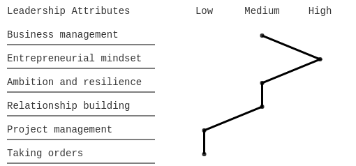

# vLine-chart
Simple vertical line chart

The vLine Chart is basicly a table with columns, rows and markers



##### To use the vLine Chart, first you need to instanciate the class
```javascript
vline = new VLine()
```

##### Then, you have to setup the font of your chart
```javascript
vline.setupFont('Courier', 16, 20)
```

1. The first parameter is the <b>font family</b>
2. The second parameter is the <b>font size</b>
3. The third parameter is the <b>font margin</b> (It is 20 by default)

##### After setting the font, you need to setup the header of your chart
```javascript
vline.setupVLineHeader('Atributos de liderança', [
    'n1',
    'n2',
    'n3',
    'n4'
])
 ```
 
1. The first parameter is the <b>title</b> of your chart
2. The second parameter is an <b>array of strings</b> which are the columns of your chart
 
##### Now you can add your rows to the chart
```javascript
vline.addElement('Alinhamento cultural', 3)
vline.addElement('Gestão de negócios', 2)
vline.addElement('Lidar com ambiguidades e incertezas', 1)
vline.addElement('Liderança de pessoas', 4)
```

1. The first parameter is the <b>description of your item</b>
2. The second parameter is the index that your row is scored</b>

##### After adding your rows you can build the chart
```javascript
vline.buildCanvas()
```
